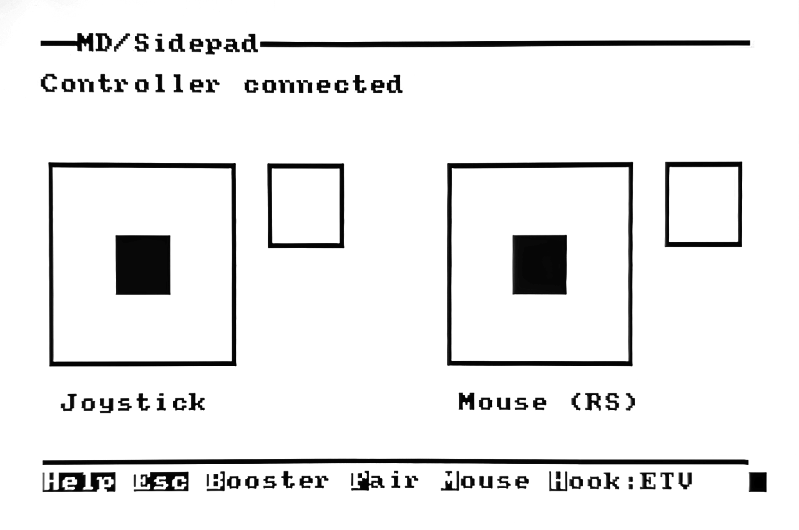
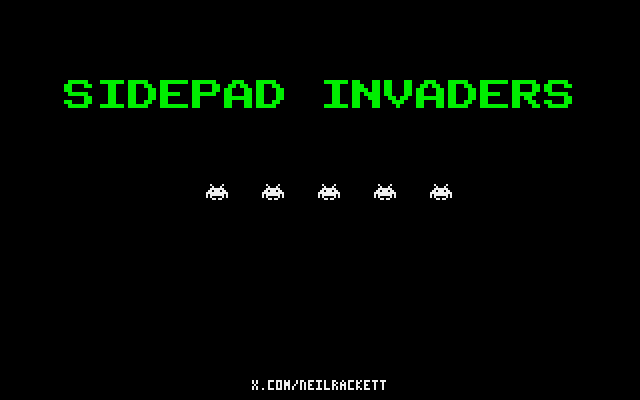
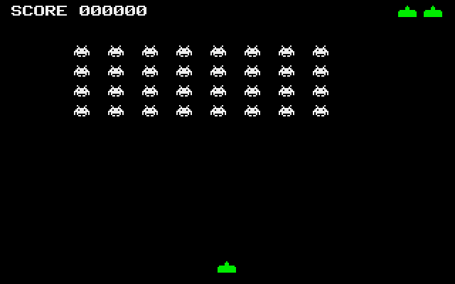
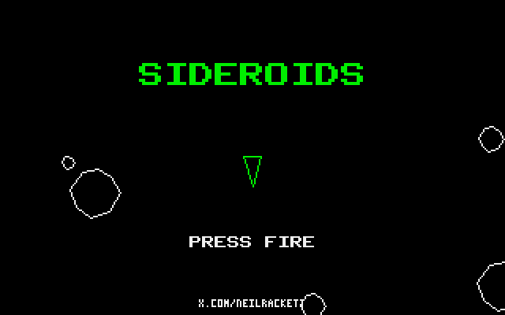
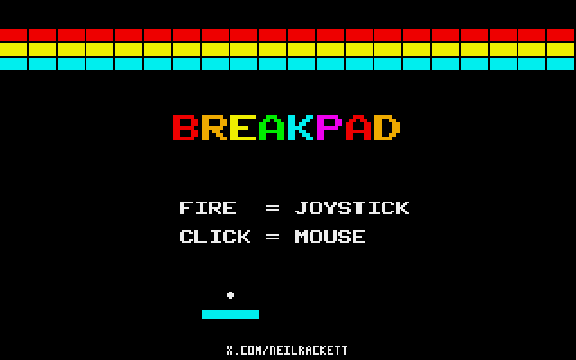
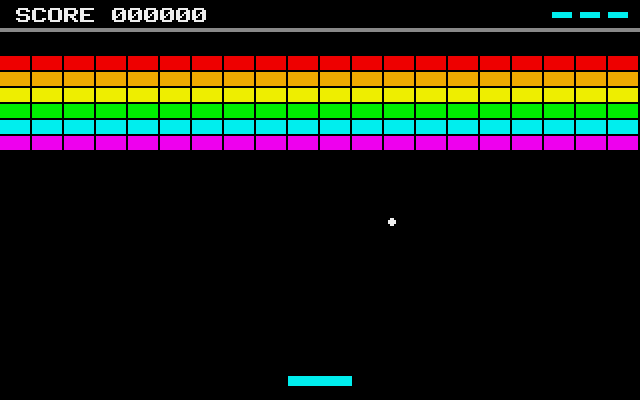
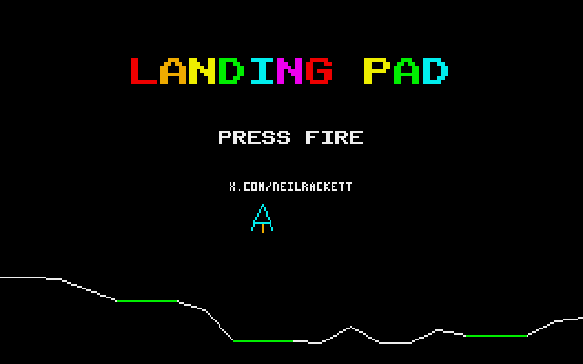
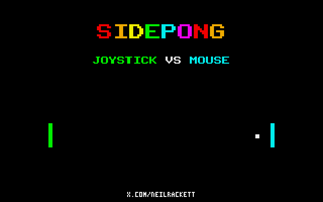
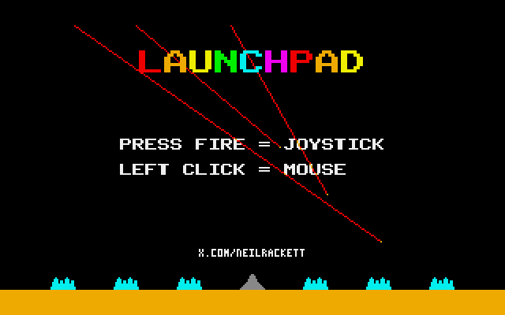
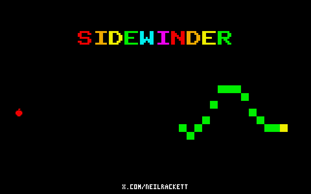

# MD/Sidepad

Microfirmware for the [SidecarTridge Multi-device](https://sidecartridge.com) by [Neil Rackett](https://x.com/neilrackett)

## Introduction

MD/Sidepad enables your SidecarTridge Multi-device to connect almost any Bluetooth gamepad (Xbox One/Series, DualShock, DualSense, Switch Pro, 8BitDo, and more) to your Atari ST and use it as a joystick and (optionally) mouse.

Once installed, simply pair your controller, press M if you'd like to use the right analogue stick as a mouse, then press ESC and you're ready to play - you can leave your existing joystick and mouse connected, MD/Sidepad works alongside them.

MD/Sidepad uses the ETV hook by default, as it's more likely to work with games, but you can switch to VBL by pressing H. Both VBL and ETV work with GEM and TOS apps.

To see MD/Sidepad working, you can use [PP's mouse and joystick tester](https://atari.8bitchip.info/astopensw.php), download [FreeNukum ST](https://github.com/neilrackett/atarist-freenukum) or try the examples below.

## Examples

<table>
  <tr>
    <td></td>
    <td></td>
    <td></td>
  </tr>
  <tr>
    <td></td>
    <td></td>
    <td></td>
  </tr>
  <tr>
    <td></td>
    <td></td>
    <td></td>
  </tr>
</table>

We've recreated some great classic games to test your Bluetooth controller with, or just play with your regular mouse and joystick if you prefer, all available in the [examples](examples/) folder:

| Name             | Description                                              | Filename                              | Mouse | Joystick |
| ---------------- | -------------------------------------------------------- | ------------------------------------- | :---: | :------: |
| Sidepad Invaders | Blast the descending alien hordes, Space Invaders style  | [INVADERS.TOS](examples/invaders.c)   |       |    ✓     |
| Sideroids        | Spin, thrust and shoot the asteroids before they get you | [SIDEROID.TOS](examples/sideroids.c)  |       |    ✓     |
| Breakpad         | Colourful Breakout-style brick basher                    | [BREAKPAD.TOS](examples/breakpad.c)   |   ✓   |    ✓     |
| Landing Pad      | Touch down gently on the pads, Lunar Lander style        | [LANDPAD.TOS](examples/landingpad.c)  |       |    ✓     |
| Sidepong         | Two-player Pong: mouse vs joystick, first to 11          | [SIDEPONG.TOS](examples/sidepong.c)   |   ✓   |    ✓     |
| Launchpad        | Defend your cities, Missile Command style                | [LAUNCHPD.TOS](examples/launchpad.c)  |   ✓   |    ✓     |
| Sidewinder       | Classic snake: eat the apples, don't bite your tail      | [SIDEWIND.TOS](examples/sidewinder.c) |       |    ✓     |

## Installation

1. Download the latest files from the [releases page](https://github.com/neilrackett/md-sidepad/releases).
2. Copy the `.uf2` and `.json` files to the `/apps` folder of your SidecarT's microSD card.
3. On the Booster screen, press ESC for the app list and select the MD/Sidepad app.
4. To return to Booster, power on and press X when the menu appears.

## Xpad

MD/Sidepad publishes your controller as an
[Xpad](https://github.com/neilrackett/atarist-xpad) block: a shared
state block, found through the cookie jar, carrying every button, stick
and trigger rather than the four directions and one fire button a
joystick can express. Software written for Xpad therefore gets the whole
pad, analogue sticks and all.

It runs alongside everything above rather than replacing it, and is
unaffected by the mouse and hook settings: those change what gets
injected, never what Xpad reports. Nothing needs enabling.

Xpad is a specification rather than a feature of this product, so
anything can publish a block and anything can read one. MD/Sidepad is
one provider among others.

The specification lives in the `xpad` submodule rather than as a copy
in this tree, so the layout this writes cannot drift from what
consumers are compiled against. Clone with `--recursive`, and update it
deliberately:

    git submodule update --remote xpad

Only one provider may own the cookie at a time, so MD/Sidepad and
another provider such as COMpad are alternatives rather than something
to run together.

## Known limitations

- MD/Sidepad talks to your Atari ST through the system `joyvec`, so games and demos that read the IKBD ACIA interrupt directly, rather than going through `joyvec`, won't see your controller as a joystick. Software that reads Xpad is unaffected: there is no hook involved, so there is nothing to bypass.
- Development has focussed on Xbox One/Series gamepads, so if you have a different controller, please let us know how you get on.

## What's next?

We've had a lots of other ideas (although that doesn't mean we'll implement them all), like:

- Can we inject IKBD ACIA interrupt directly to support more games?
- Map buttons to keys?
- Multiple gamepads?
- Support Bluetooth mice?
- Support Bluetooth keyboard?

Think you can help? Got an idea of your own? We'd love to hear from you, so why not let me know on [X](https://x.com/neilrackett) or submit a PR.

## License

The source code of the project is licensed under the GNU General Public License v3.0. The full license is accessible in the [LICENSE](LICENSE) file.
